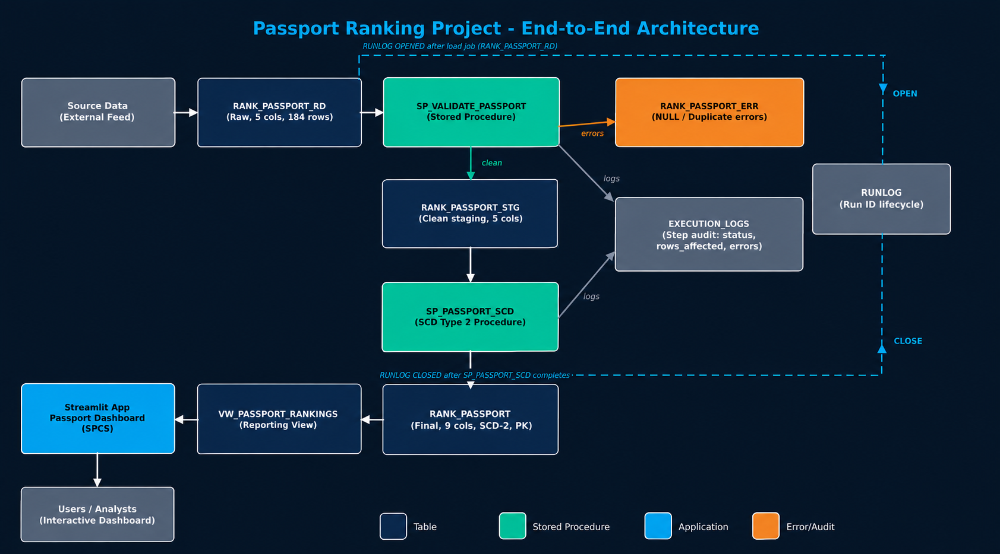

# 🌍 Passport Ranking — Snowflake Data Engineering Project

An end-to-end **Snowflake Data Engineering project** that processes yearly passport ranking data using a scheduled batch pipeline, data validation, **SCD Type 2**, Snowflake Tasks, and GitHub-based source control and CI/CD.

The project demonstrates how raw CSV data can be loaded into Snowflake, transformed through staging, historized in a target table, and consumed through a Streamlit dashboard.

---

## 📌 Project Overview

The Passport Ranking pipeline processes passport ranking data by year.

The solution uses a **batch processing architecture** where a scheduled Snowflake Task loads the source CSV into the Raw Data table, followed by transformation and SCD Type 2 processing.

### Key capabilities

* Batch CSV ingestion
* Snowflake external/internal stage
* Scheduled Snowflake Tasks
* Raw → Staging → Target architecture
* Data validation
* SCD Type 2 historical tracking
* Yearly passport ranking processing
* Views for reporting
* Streamlit dashboard
* GitHub source control
* DEV → PROD CI/CD

---

# 🏗️ Architecture


---

# 🔄 Batch Processing Flow

The pipeline runs as a scheduled batch process.

```text
CSV
 ↓
Snowflake Stage
 ↓
Scheduled Task
 ↓
TRUNCATE RD
 ↓
COPY INTO RD
 ↓
Validation
 ↓
STG
 ↓
SCD Type 2
 ↓
TRG
 ↓
Views
 ↓
Dashboard
```

The Raw Data table is refreshed for each batch before the latest source data is loaded.

---

# 🗄️ Data Architecture

The project follows a three-layer data architecture:

```text
RD → STG → TRG
```

## 1. RD — Raw Data

The Raw Data layer stores the current batch of source data.

Example:

```text
RANK_PASSPORT_RD
```

Responsibilities:

* Receive source CSV data
* Preserve the source structure
* Provide the input for downstream processing

The batch task truncates the RD table before loading the current source file.

---

## 2. STG — Staging

The Staging layer prepares the data for the target table.

Example:

```text
RANK_PASSPORT_STG
```

Responsibilities:

* Data validation
* Transformation
* Duplicate checks
* Required-field validation
* Preparation for SCD Type 2 processing

---

## 3. TRG — Target

The Target layer contains the final historical passport ranking data.

Example:

```text
RANK_PASSPORT_TRG
```

The target table maintains historical changes using **SCD Type 2**.

---

# 🔁 SCD Type 2

The project uses **Slowly Changing Dimension Type 2** to preserve historical ranking changes.

When a country's ranking changes:

```text
Existing Active Record
        │
        ▼
End-date old record
        │
        ▼
Insert new ranking
        │
        ▼
New active record
```

Example:

```text
COUNTRY | RANK | STRT_DT   | END_DT
--------|------|-----------|-----------
India   | 80   | 2024-01-01| 2024-12-31
India   | 85   | 2025-01-01| 9999-12-31
```

This allows historical ranking changes to be retained rather than overwritten.

---

# ⏱️ Snowflake Task

The batch pipeline is orchestrated using a scheduled Snowflake Task.

Example schedule:

```text
00:59 Asia/Kolkata
```

The task performs the batch ingestion process:

```text
TRUNCATE RD
     ↓
COPY CSV → RD
     ↓
Validation / Transformation
     ↓
STG
     ↓
SCD Type 2
     ↓
TRG
```

Example task:

```sql
CREATE OR REPLACE TASK SHPROD.PUBLIC.LOAD_PASSPORT_JOB
    WAREHOUSE = 'COMPUTE_WH'
    SCHEDULE = 'USING CRON 59 0 * * * Asia/Kolkata'
AS
...
```

---

# 📂 Repository Structure

```text
snowflake-data-engineering-projects/
│
├── .github/
│   └── workflows/
│       └── snowflake-cicd.yml
│
├── tables/
│   └── tables.sql
│
├── scripts/
│   └── fileformat.sql
│   └── stage.sql
├── procedures/
│   └── pvt.sql
│   └── scd.sql
├── tasks/
│   └── task.sql
│
├── views/
│   └── views.sql
│
├── streamlit/
│   └── passport_ranking/
│       └── pyproject.toml
│       └── snowflake.yml
│       └── streamlit_app.py    
│
├── docs/
│   └── passport_ranking_document.docx
│   └── passport_ranking_document.ppt
└── README.md
```

The repository separates Snowflake objects by object type while keeping the project organized and version-controlled.

---

# 🧱 Snowflake Objects

The project contains the following Snowflake components:

| Object      | Purpose                             |
| ----------- | ----------------------------------- |
| Tables      | RD, STG and TRG data layers         |
| Stage       | Source CSV landing                  |
| File Format | CSV parsing configuration           |
| Tasks       | Batch orchestration                 |
| Procedures  | Transformation/business logic       |
| Views       | Reporting and dashboard consumption |
| Streamlit   | Data visualization                  |

---

# 📊 Streamlit Dashboard

The processed target data is exposed through a Streamlit dashboard.

The dashboard provides insights such as:

* Passport ranking by year
* Country ranking
* Ranking changes
* Historical trends
* Country comparisons
* Passport access information

Dashboard location:

```text
streamlit/passport_ranking/
```

---

# 🔀 Git Branching Strategy

The project uses two primary branches:

```text
feature/*
     │
     ▼
    dev
     │
     │ Pull Request
     ▼
   main
```

### `dev`

Development branch.

Changes are tested in the Snowflake DEV environment.

### `main`

Production branch.

Only tested changes are promoted from:

```text
dev → main
```

through a Pull Request.

---

# ⚙️ CI/CD

GitHub Actions is used for CI/CD automation.

```text
Developer
    │
    ▼
feature/*
    │
    ▼
   dev
    │
    ▼
GitHub Actions
    │
    ▼
Snowflake DEV
    │
    │ Testing
    ▼
Pull Request
    │
    ▼
   main
    │
    ▼
GitHub Actions
    │
    ▼
Snowflake PROD
```

### DEV deployment

A push to:

```text
dev
```

triggers the CI/CD pipeline and deploys the Snowflake objects to DEV.

### PROD deployment

After testing, a Pull Request is created:

```text
dev → main
```

After approval and merge, GitHub Actions deploys the production version to Snowflake PROD.

---

# 🔐 Security

Sensitive credentials are not stored in the repository.

GitHub Actions uses GitHub Secrets for authentication.

### Secrets

```text
SNOWFLAKE_ACCOUNT
SNOWFLAKE_USER
SNOWFLAKE_PASSWORD
```

### Variables

```text
SNOWFLAKE_ROLE
SNOWFLAKE_WAREHOUSE
```

Credentials should never be committed directly into SQL scripts, YAML files, or source code.

---

# 🧪 Data Validation

The pipeline performs validation before data reaches the target layer.

Examples:

```text
✓ Country name cannot be NULL
✓ Duplicate records can be identified
✓ Required fields are validated
✓ Ranking values are validated
✓ Source structure is checked
✓ Target data is maintained historically
```

Invalid data can be rejected before the SCD Type 2 process.

---

# 🛠️ Technology Stack

| Technology      | Purpose              |
| --------------- | -------------------- |
| Snowflake       | Cloud Data Warehouse |
| Snowflake SQL   | Data transformation  |
| Snowflake Tasks | Batch orchestration  |
| Snowflake Stage | File landing         |
| SCD Type 2      | Historical tracking  |
| GitHub          | Source control       |
| GitHub Actions  | CI/CD                |
| Streamlit       | Dashboard            |
| CSV             | Source data          |

---

# 🎯 Project Highlights

* End-to-end Snowflake data engineering pipeline
* Batch processing architecture
* Raw → Staging → Target data layers
* SCD Type 2 implementation
* Scheduled Snowflake Task
* Data quality validation
* Historical passport ranking tracking
* GitHub source control
* DEV and PROD environments
* Automated CI/CD
* Streamlit dashboard

---

# 🚀 Future Enhancements

Potential improvements include:

* Automated data-quality test framework
* Snowflake key-pair/OIDC authentication
* CI/CD deployment rollback
* Pipeline monitoring and alerting
* Batch execution logging
* Error-handling framework
* Automated failure notifications
* Additional dashboard analytics
* Infrastructure-as-Code
* Automated documentation

---

## 👨‍💻 Project

**Passport Ranking Data Engineering Project**

Built with **Snowflake, SQL, Snowflake Tasks, SCD Type 2, GitHub, GitHub Actions, and Streamlit**.
